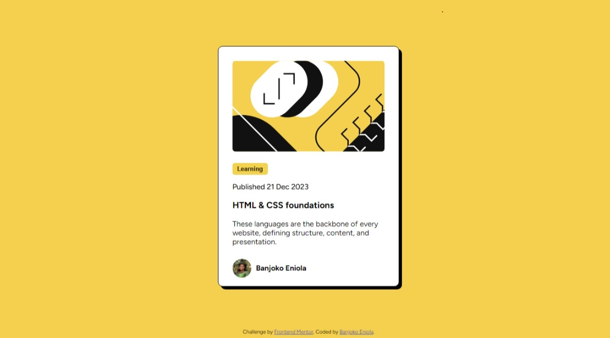

# Banjoko Eniola Frontend Mentor - Blog preview card solution

This is a solution to the [Blog preview card challenge on Frontend Mentor](https://www.frontendmentor.io/challenges/blog-preview-card-ckPaj01IcS). Frontend Mentor challenges help you improve your coding skills by building realistic projects. 

## Table of contents

- [Banjoko Eniola Frontend Mentor - Blog preview card solution](#banjoko-eniola-frontend-mentor---blog-preview-card-solution)
  - [Table of contents](#table-of-contents)
  - [Overview](#overview)
    - [The challenge](#the-challenge)
    - [Screenshot](#screenshot)
    - [Links](#links)
    - [Built with](#built-with)
    - [What I learned](#what-i-learned)
  - [Author](#author)
  - [Acknowledgments](#acknowledgments)


## Overview

### The challenge

Users should be able to:

- See hover and focus states for all interactive elements on the page

### Screenshot




### Links

- Solution URL: (https://github.com/Ayinketimi/Blog-preview-card)
- Live Site URL: (https://bright-biscochitos-316e99.netlify.app/)


### Built with

- Semantic HTML5 markup
- CSS custom properties
- Flexbox
- CSS Grid
- Visual Studio Code 


### What I learned

I learnt how to use box-shadow to shadow a box or border
I learnt how to create hoover effect on a text.

To see how you can add code snippets, see below:

```html
<div class="gen">
  
  
  <h4 id="ex">Banjoko Eniola</h4>
  
  </div>
```
```css
.container {
    width: 25%;
    margin: 90px auto;
    border: 1px solid;
    background-color: #ffffff;
    border-radius: 10px;
    padding: 30px;
    box-shadow: 6px 6px black;
    height: 450px;

}
```

## Author

Name : Banjoko Eniola

## Acknowledgments

Thankfull to my mentor Black Adam for guiding me on how to approch the project.
